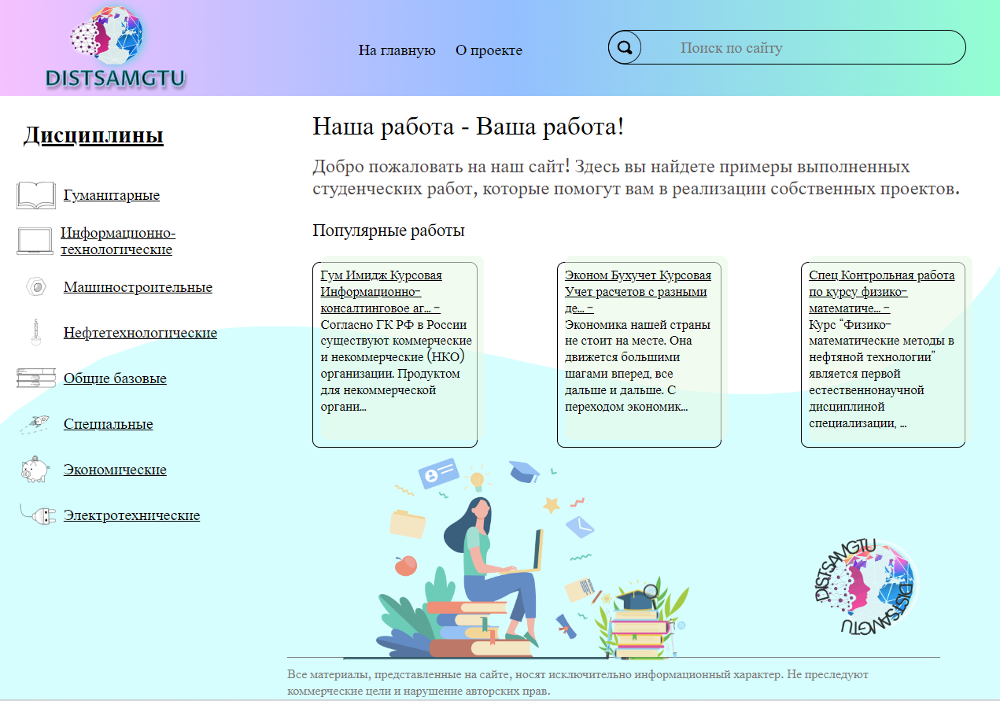
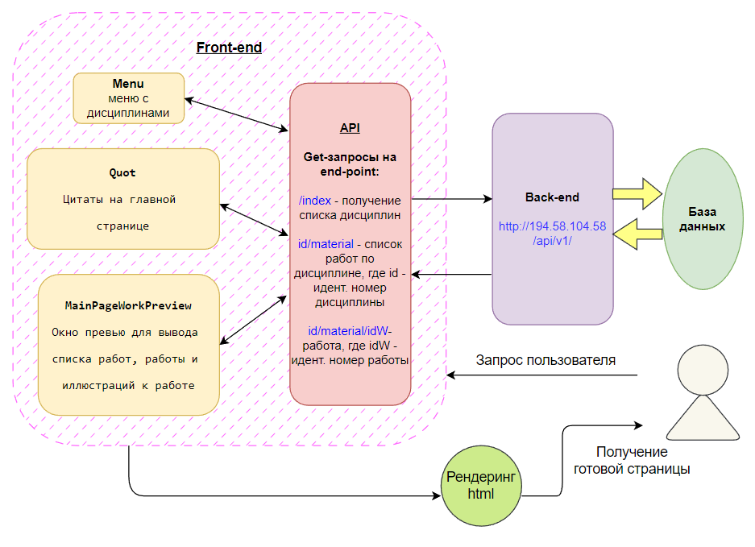

## Samgstudist (Distsamgtu)
___

### 🌍 Ссылки на проект:

* [http://194.58.104.58:8088](http://194.58.104.58:8088) - временный сервер
* [https://distsamgtu.ru](https://distsamgtu.ru) - постоянный хостинг (деплой проекта в процессе)
* [Презентация](https://disk.yandex.ru/i/lnO7Ip8Swv4UZA) - информация об основных этапах создания проекта
* [Git projects](https://github.com/users/Andrey-Grishkov/projects/2/views/1) - доска задач Front-end разработчиков
___
### ✍ Описание:

Сайт представляет из себя библиотеку примеров студенческих работ по различным дисциплинам.


*Главная страница*

На сайте есть шапка с навигацией и поиском, главная вкладка, на которой приведены кликабельные 
отрывки из популярных работ, слева имеется меню для выбора дисциплины, по нажатии на дисциплину
пользователь переходит на вкладку со списком работ. При выборе работы из списка, открывается текст
работы, при помощи кнопок листаются страницы, и есть кнопка на показ иллюстраций (если имеются в работе).
Также имеются вкладки с описанием проекта и с составом команды разработчиков.
Проект имеет Front-end и Back-end части. С Back-end части по запросу поступают на Front-end часть
список дисциплин, перечень работ по каждой дисциплине, работы и иллюстрации.


*Схема API*

___

### 🔨 Стек технологий:

*Html, CSS, Sass, Git, JavaScript, React, Redux, Axios*  


  


___

### 🤔  Планы по развитию проекта:
* Закончить деплой на постоянный сервер
* Реализовать функцию поиска работ
* Исправить оставшиеся баги, найденные командой тестировщиков
* Реализовать регистрацию и авторизацию, а также разные права доступа на сайт
* Реализовать возможность добавления и удаления работ и дисциплин
* Провести встречу с опытными разработчиками и по итогам провести рефакторинг кода

___

### 📖  Инструкция по запуску на локальной машине:
* Установить [Node.js](https://nodejs.org/ru/)
* Клонировать репозиторий ``` git clone git@github.com:Andrey-Grishkov/samgstudist.git```
* Установить зависимости ``` npm install ```
* Запустить приложение ``` npm run start ```
